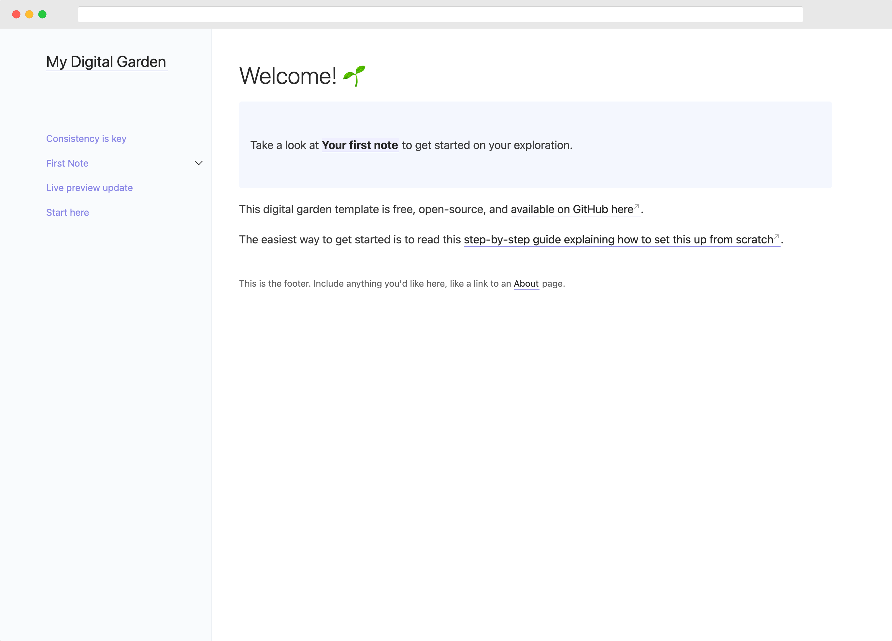

<header>
Information here and there about the notes and the website
</header>

<hr>
## Table of Contents
{:.no_toc .toc-heading}
1. 
{:toc}
<hr>

## Basic Information

This site is created using the static site generator [Jekyll](https://jekyllrb.com), modified from the [Jekyll Digital Garden Theme](https://github.com/maximevaillancourt/digital-garden-jekyll-template), inspired by the [Obsidian Help Page](https://help.obsidian.md) and the Jekyll [Just the Docs](https://github.com/just-the-docs/just-the-docs) theme. Visit the site repository [here](https://github.com/andyw-0612/andyw-0612.github.io). 

<br>

<br>

This will be a place where I put down my random thoughts and notes on the online courses I stroll through from time to time. This site is hosted through Github Pages and Github Actions. Due to Github not being compatible with Jekyll sites that have custom plugins, the site is pushed onto the `master` branch on Github but built through a [workflow](https://github.com/andyw-0612/andyw-0612.github.io/blob/master/.github/workflows/main.yml) to the `gh-pages` branch as static `html`, `css`, and `javascript` files, then the Github pages is built from that branch as opposed to the usual `master` branch. 

A lot of customization went into building the website and I'll try my best to sort through and document everything for one day if my future self wants to come back.

### Running the Site Locally

If you have [Ruby](https://www.ruby-lang.org/en/) and [Bundler](https://bundler.io) installed, running the site is as simple as running the following commands. 

```shell
bundle install
bundle exec jekyll serve
```

> [!Info]
>  For a more detailed tutorial on running Jekyll sites locally, visit the official Github Pages Documentation [here](https://docs.github.com/en/pages/setting-up-a-github-pages-site-with-jekyll/testing-your-github-pages-site-locally-with-jekyll).
> 

### Pushing to GitHub

Every time a push/commit is performed, a Github workflow will be triggered, which builds the site at the directory set by the `destination` attribute in `_config.yml`. The `destination` attribute must be set to `./build`, or the GitHub workflow will not work. Everything in `./build` is then pushed to a separate branch, `gh-pages`, the branch from GitHub Pages that will deploy the site. 

For future reference, the GitHub workflow can be found [here](https://github.com/andyw-0612/jekyll-deploy-gh-pages). 

GitHub Actions uses YAML syntax to define the workflow. Each workflow is stored as a separate YAML file in your code repository in a directory named `.github/workflows`.

You can create an example workflow in your repository that automatically triggers a series of commands whenever code is pushed. The following workflow, which is the one that this website uses, builds a Jekyll site from the current branch and pushes it to another branch which can be deployed via GitHub Pages.


```yaml
# .github/workflows/main.yml

name: jekyll-deploy-gh-pages

on: [push]

jobs: 
  build_and_deploy:
    runs-on: ubuntu-latest
    steps:
      - uses: actions/checkout@v1
      - name: Build & Deploy to GitHub Pages
        env: 
          GITHUB_TOKEN: ${{ secrets.GITHUB_TOKEN }}
          GITHUB_REPOSITORY: ${{ secrets.GITHUB_REPOSITORY }}
          GITHUB_ACTOR: ${{ secrets.GITHUB_ACTOR }}
        uses: andyw-0612/jekyll-deploy-gh-pages@master

```


## Configuration

Global site settings are configured in `_config.yml`. 

### Behavioral Configuration

`use_html_extension`: if you use a static host that doesn't support URLs that don't end with `.html` (such as Neocities), try changing the `use_html_extension` value to `true` in the `_config.yml` file and restart the Jekyll server (or re-build the site). This adds a `.html` extension to note URLs and may resolve issues with links.

`open_external_links_in_new_tab`: when set to `true`, external links open in new tabs. Set to `false` to open all links in the current tab.

`embed_tweets`: when set to `true`, tweet URLs on their own lines will be replaced with a Twitter embed. The default value is `false`.

## A Pile of Unorganized Reminders and Notes

- To use the `raw` tag to display liquid syntax for inline code, the `raw` and `endraw`  tags must be outside of the backticks which enclose the inline code block

- To embed math, wrap math stuff with single dollar signs $for \space inline \space math$ and double dollar signs for block math.

	$$\int\limits_{0}^{1} \int\limits_{0}^{1} \int\limits_{0}^{1} xyz , dx , dy , dz $$

- Refer to [[2022-12-22]] for information on the title front matter.

- Internal links to another note can be written with the `[[Double Bracket]]` link syntax or the plain old `[markdown style](path/to/note)`. 

- Wikilinks point directly to the note's `title` attribute in the front matter. Currently, using the relative path to the notes is not supported.

- Liquid  ``  will not work as one of the plugins that I wrote complies markdown files through the official Liquid library, which does not support the highlight tag, a custom feature implemented by Jekyll. 

- Images can be embedded using the `![[Obsidian.png]]` syntax or the plain old ``. HTML `img` tags only work with images linked through URLs in Obsidian. 

- Although for image embeds, Obsidian supports configuring the height and width properties of the image by using a pipe operator as such `![[image.png|height x width]]`, the Jekyll website cannot do so. Additionally, setting explicit height and width values makes the image incompatible with mobile devices due to the difference in screen ratio. 

- It is possible to configure a description for each note by enclosing the text between HTML `header` tags at the top of the note. This description will be displayed as lighter-colored text under the note heading.

- To create a parent page with child pages, add the following line to the front matter of parent pages:

	```yaml
	---
	title: Note Title
	has_children: true
	---
	```
	
	On child pages, set the front matter attribute `has_parent` to their respective parent page's `title`. Remember, the `has_parent` attribute must point to the parent page's `title`, not the file name!

- At the end of every parent page, there will be an automatically generated table of content listing its child pages. Currently, there is no way of disabling it.

- Although not required, it is preferred to create a separate directory within `/_notes` to store the parent page along with its child pages.

- Kramdown, the markdown version that Jekyll uses, can generate an automatic table of contents for the headings in every note by placing the following lines at the start of every note (After `header` tags, if any). 

	```markdown
	## Table of Contents
	{:.no_toc .toc-heading}
	1. 
	{:toc}
	```

- Visit Obsidian's official [documentation](https://help.obsidian.md/Obsidian/Index) for help on markdown syntax and everything else related to Obsidian.

> [!Warning]
> Callouts will not show up on the website unless there's at least a line below it (blank or not, it does not matter)
>
> The custom Jekyll plugin I wrote for callouts needs some tweaking and debugging

## Current Workflow

Obsidian is used for note-taking with the `_notes` directory as the Obsidian vault. Images and media for notes are stored in `_notes/notes-media`. Visual Studio Code is used to add, commit, and push changes to the remote repository on GitHub. GitHub will automatically deploy the updated changes through GitHub Actions to GitHub Pages at [andyw-0612.github.io](https://andyw-0612.github.io). 

## To-Dos

- Implement heading anchor links; an example can be found [here](https://github.com/allejo/jekyll-anchor-headings). 
- Implement support for markdown task lists.
- Revamp side navigation based on file structures instead of front matters.
- Revise the callout logic to be similar to the way in which Wikilinks and image embeds are parsed so that callouts within fenced code blocks will not be processed.
- Customize callouts.
- Embed Notes.
- Write an explanation/documentation explaining the custom plugins I wrote, which were not originally included in the [Digital Garden](https://github.com/maximevaillancourt/digital-garden-jekyll-template) template. 
- Add a markdown reference note as a child note of this note.
- Implement a site-wide search functionality using `lunar.js`.